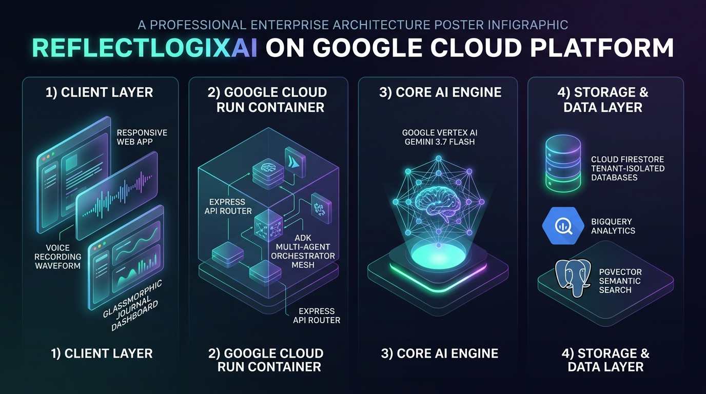

# ReflectLogixAI – Your Multi-Purpose Personal Gemini Journal

[](https://github.com/sivasubramanian86/ReflectLogixAI/actions/workflows/ci.yml)
[](https://cloud.google.com/run)
[](https://ai.google.dev/)
[](https://www.w3.org/WAI/standards-guidelines/wcag/)
[](LICENSE)

**ReflectLogixAI** is a multi-agent personal journaling, emotional intelligence, and cognitive reflection platform built for the **Google Cloud Run AI Challenge**. Powered by **Google Gemini 3.7 / 2.5 Flash**, **Google Agent Development Kit (ADK)**, **Firebase Authentication**, **Cloud Firestore Zero-Trust Tenant Isolation**, and **Model Context Protocol (MCP)**.

---

## 🏛️ System Architecture



> 📖 **Architecture & Deep Dive Documentation:**
> - [System Architecture Specification & Topology](docs/architecture/system-architecture.md)
> - [End-to-End User Experience & Interaction Flow](docs/architecture/user-flow.md)
> - [Google ADK Multi-Agent Orchestration Mesh](docs/architecture/multi-agent-mesh.md)
> - [Zero-Trust Security & IAM Specification](infra/security_spec.md)

---

## ✨ Core Pillars & Capabilities

### 1. Authenticity & Emotional Clarity
- **Socratic Reflection Coach**: Applies cognitive reframing and targeted questions to foster self-compassion without unsolicited judgment.
- **Russell's Circumplex Affect Model**: Tracks continuous emotional coordinates (Valence: $-1.0$ to $+1.0$, Arousal: $0.0$ to $1.0$) and discrete stress intensity ($1$ to $10$).
- **Live Gemini Voice Journaling**: Dictate thoughts hands-free with real-time waveform visualization and multi-turn audio streaming.

### 2. Usability & WCAG 2.2 AA Accessibility
- **Production-Grade 3-Pane Interface**:
  - *Left Pane*: Timeline list with category filters (Today, Yesterday, Week, Month), mood tags, search query, and New Entry CTA.
  - *Center Pane*: Rich journal canvas with auto-save, token counter, image attachments, Socratic Reflection Card, and multi-turn coach conversation thread.
  - *Right Pane*: Longitudinal affect trajectory charts (Recharts), stress index gauge, top tags, micro-action checklist, and Sensitive Entry / Detox Mode toggles.
- **Full Keyboard & Screen Reader Accessibility**: Strict landmark hierarchy (`<header>`, `<nav>`, `<main>`, `<aside>`), ARIA live regions (`aria-live="polite"`), modal focus traps, and touch targets $\ge 44 \times 44\text{px}$.
- **18+ Language Internationalization**: English, Tamil (தமிழ்), Hindi (हिन्दी), Telugu (తెలుగు), Kannada (ಕನ್ನಡ), Malayalam (മലയാളം), Bengali (বাংলা), Marathi (मराठी), Gujarati (ગુજરાતી), Punjabi (ਪੰਜਾਬੀ), Arabic (العربية), French, German, Spanish, Portuguese, Russian, Japanese, and Chinese.

### 3. Agentic RAG & MCP Extensibility
- **"Ask My History" Agentic RAG**: Hybrid semantic vector retrieval via Cloud SQL / pgvector over historical journal embeddings.
- **GraphRAG Life Entity Subgraph**: Traverses interconnected life entities (People, Places, Core Values, Goals, Habits, Emotions).
- **BigQuery Longitudinal Trends**: Rollup analytics calculating active streaks, word frequency, and stress reduction velocity.

### 4. Zero-Trust Security & DevSecOps
- **Strict Tenant Isolation**: All Firestore operations reside in `/users/{userId}/journals/{journalId}` guarded by `request.auth.uid == userId`.
- **Google Cloud Secret Manager**: Credentials (`GEMINI_API_KEY`, `GOOGLE_MAPS_API_KEY`, Slack/Discord webhooks) are loaded server-side and never leaked to client bundles.
- **Detox Mode & Sensitive Entries**: Zero-retention ephemeral processing for sensitive entries with PII scrub.
- **SSRF & Outbound Data Sanitization**: External webhooks enforce HTTPS validation, block internal IP metadata ranges, and transmit only sanitized summaries upon user opt-in.
- **Append-Only Audit Trail**: Administrative mutations log immutable records with masked IP addresses (`192.168.***.***`).

---

## 📁 Monorepo Structure

```
reflectlogixai/
├── apps/
│   ├── web/                      # Modular React 19 frontend workspace
│   │   ├── src/pages/            # 3-Pane JournalPage layout & views
│   │   ├── src/tests/            # Frontend Vitest suite
│   │   └── package.json
│   └── api/                      # Modular Express backend workspace
│       ├── src/routes/           # Modular HTTP routes (journals, insights, admin)
│       ├── src/middleware/       # Zero-trust auth, RBAC, audit logging
│       ├── src/services/         # Secret Manager & Gemini client adapters
│       ├── src/tests/            # Backend Vitest suite
│       ├── Dockerfile            # Multi-stage Cloud Run Dockerfile
│       └── package.json
├── agents/                       # ADK Python multi-agent orchestration
│   ├── orchestrator/             # DAG execution engine (workflow_engine.py)
│   ├── subagents/                # Reflection coach, mood, planner, localization, context
│   ├── mcp_tools/                # BigQuery, pgvector, GraphRAG Neo4j MCP clients
│   ├── tests/                    # Comprehensive Pytest test suite
│   └── requirements.txt
├── infra/
│   ├── firestore.rules           # Zero-trust security rules with tenant isolation
│   ├── firebase-blueprint.json   # Entity schema and collection blueprint
│   ├── security_spec.md          # Dirty Dozen threat modeling & mitigation matrix
│   └── cloudrun/                 # Cloud Run service deployment descriptors
├── .github/
│   └── workflows/
│       ├── ci.yml                # Type check, Vitest, Pytest, Gitleaks security scan
│       └── deploy-cloudrun.yml   # Gated Cloud Run deployment
├── docs/                         # OpenAPI contracts, architecture, and UX diagrams
├── SKILL.md                      # Antigravity skill encoding security & ADK rules
├── agents.md                     # Antigravity agent personas
├── README.md                     # Portfolio documentation
├── LICENSE                       # MIT License
├── SECURITY.md                   # Vulnerability disclosure & zero-trust policy
├── CONTRIBUTING.md               # Developer contribution guidelines
├── CODE_OF_CONDUCT.md            # Contributor Covenant standard
├── SUPPORT.md                    # Support channels & FAQs
└── package.json                  # Root monorepo configuration
```

---

## 🚀 Quick Start & Development

### 1. Prerequisites
- **Node.js**: v20+
- **Python**: v3.11+
- **npm** or **bun**

### 2. Installation
```bash
# Clone the repository
git clone https://github.com/sivasubramanian86/ReflectLogixAI.git
cd ReflectLogixAI

# Install Node dependencies
npm install

# Install Python agent dependencies
pip install -r agents/requirements.txt
```

### 3. Environment Configuration
Copy the example environment configuration:
```bash
cp .env.example .env
```
Provide your `GEMINI_API_KEY` (obtainable from [Google AI Studio](https://aistudio.google.com/)).

### 4. Run Development Server
```bash
npm run dev
```
Open [http://localhost:3000](http://localhost:3000) in your browser.

---

## 🧪 Testing Suite

### Run All Automated Tests
```bash
# Execute TypeScript Vitest suite (Frontend & Backend)
npm test

# Execute Python ADK & MCP Pytest suite
npm run test:agents

# Execute full end-to-end verification
npm run test:all
```

---

## 🚢 Google Cloud Run Deployment

Deploy containerized service directly to Google Cloud Run:

```bash
gcloud run deploy reflectlogixai-journal \
  --source . \
  --region asia-southeast1 \
  --allow-unauthenticated \
  --port 3000 \
  --memory 1Gi \
  --cpu 1 \
  --set-env-vars NODE_ENV=production,GEMINI_MODEL=gemini-3.7-flash
```

---

## 📄 License & Community
- **License**: [MIT](LICENSE)
- **Security Policy**: [SECURITY.md](SECURITY.md)
- **Contributing**: [CONTRIBUTING.md](CONTRIBUTING.md)
- **Code of Conduct**: [CODE_OF_CONDUCT.md](CODE_OF_CONDUCT.md)
- **Support & FAQ**: [SUPPORT.md](SUPPORT.md)
