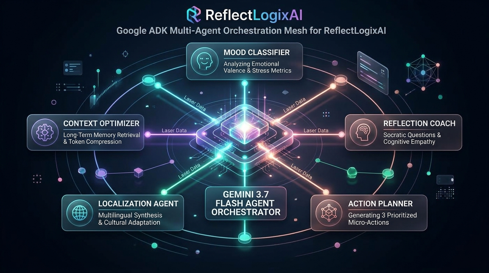
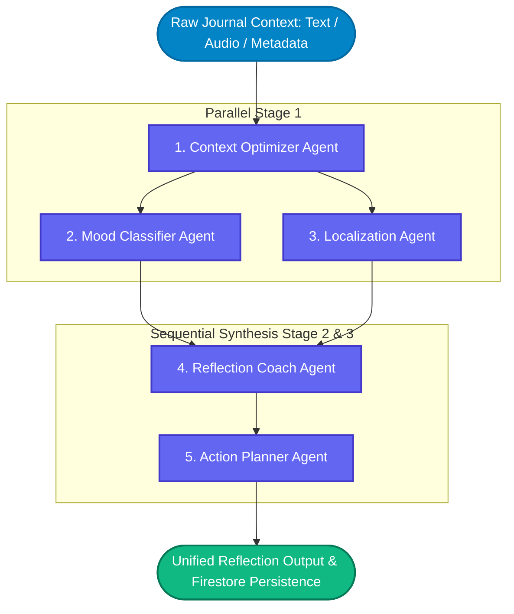

# ReflectLogixAI - Google ADK Multi-Agent Orchestration Mesh

## 1. Multi-Agent Mesh Design

ReflectLogixAI deploys a specialized multi-agent mesh inspired by the **Google Agent Development Kit (ADK)**. Rather than relying on a single monolithic LLM prompt, responsibility is decomposed across five focused subagents orchestrated in a directed acyclic graph (DAG).

### Mermaid DAG: Multi-Agent Pipeline

---

## 2. Subagent Roles & Responsibilities

| Subagent | Core Responsibility | Input Parameters | Output Schema |
|---|---|---|---|
| **Context Optimizer** | Evaluates active token budget, retrieves historical semantic memory, and minimizes redundant context. | Raw entry, user past entries, user long-term profile | Compressed context window, retrieved memory anchors |
| **Mood Classifier** | Evaluates emotional tone, valence (-1.0 to +1.0), stress score (1 to 10), and emotional triggers. | Current entry content | `{ valence, arousal, stressScore, primaryMood, triggers }` |
| **Localization Agent** | Detects input language, preserves cultural nuance, and generates bilingual summaries. | Content, user preferred language | `{ detectedLanguage, originalSummary, englishSummary, keyPhrases }` |
| **Reflection Coach** | Applies Socratic inquiry, cognitive reframing of negative distortions, and highlights personal strengths. | Content, mood output, compressed history | `{ deepReflection, reframedPerspective, socraticQuestions }` |
| **Action Planner** | Converts reflections into exactly 3 prioritized, achievable micro-actions for personal growth. | Deep reflection, cognitive goals | `{ microActions: [{ id, action, priority, timeframe }] }` |
