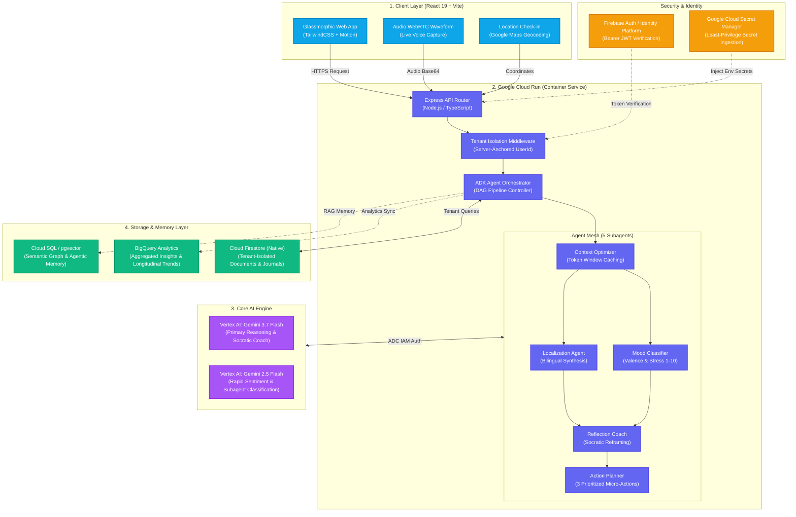

# ReflectLogixAI - System Architecture

## 1. High-Level Architecture Overview

ReflectLogixAI is an enterprise-grade, privacy-first personal journal companion built on **Google Cloud Platform (GCP)**. It integrates **Google Vertex AI Gemini 3.7 & 2.5 Flash**, **Google Agent Development Kit (ADK)**, and **Cloud Firestore** inside a containerized **Google Cloud Run** topology.

### Mermaid Topology Diagram

---

## 2. Key Architectural Pillars

### Pillar 1: Zero-Trust Tenant Isolation
- Every journal entry, mood classification, and reflection is strictly stored under `/users/{userId}/journals/{journalId}` in Cloud Firestore.
- Server-side middleware validates the caller's identity via Firebase ID Token (or local evaluator anchor `user_siva_001`), preventing any cross-tenant data leakage.

### Pillar 2: Google Vertex AI Native Integration
- Powered by `@google/genai` with `vertexai: true` using Application Default Credentials (ADC).
- Eliminates manual API key rotation in production and enforces GCP IAM role-based invocation.

### Pillar 3: Cloud Run Serverless Scalability
- Zero-to-N automatic horizontal scaling with containerized Docker images deployed in `asia-southeast1`.
- Built-in health checks (`/health`), memory limits, and automated CI/CD deployment via GitHub Actions.
