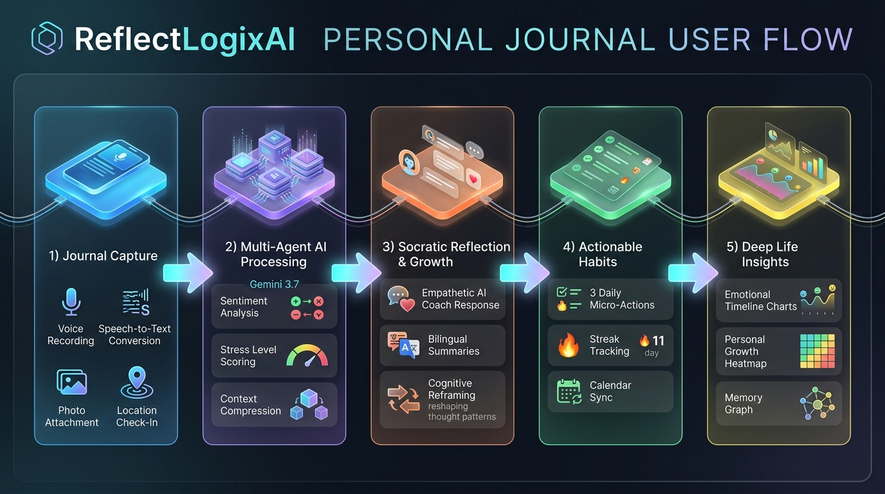
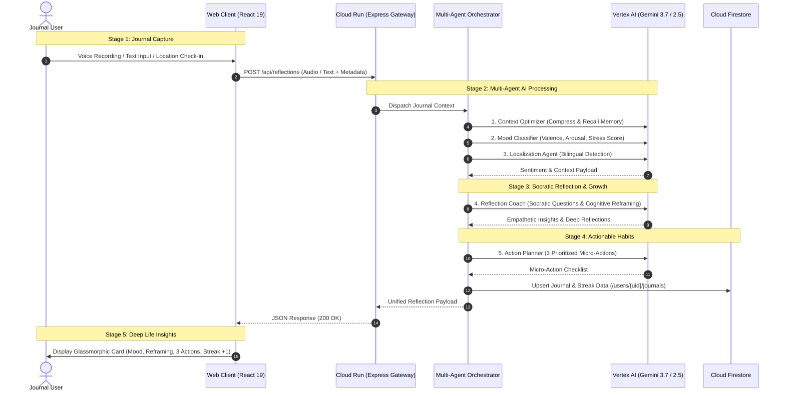

# ReflectLogixAI - User Experience & Interaction Flow

## 1. End-to-End User Experience Lifecycle

ReflectLogixAI transforms raw daily thoughts into deep cognitive reflections and micro-habits through a 5-stage sequential lifecycle.

### Mermaid Flowchart: 5-Stage Interaction Cycle

---

## 2. The 5 Interaction Stages Explained

### Stage 1: Journal Capture
- **Multimodal Capture**: Users express thoughts via voice recording (live WebRTC audio stream converted to text) or typed markdown text.
- **Contextual Anchors**: Optional location tagging (via Google Maps geocoding) and life area tagging (**Work**, **Health**, **Relationships**, **Growth**, **Creativity**).

### Stage 2: Multi-Agent Processing
- Context Optimizer prunes token history and retrieves relevant historical entries.
- Mood Classifier quantifies valence (-1.0 to +1.0), stress score (1-10), and emotional triggers.
- Localization Agent auto-detects language (Tamil, Hindi, Spanish, French, German, Japanese, English) and prepares bilingual bridges.

### Stage 3: Socratic Reflection & Growth
- Reflection Coach applies empathetic inquiry and cognitive reframing, helping users challenge negative cognitive distortions into constructive perspectives.

### Stage 4: Actionable Habits & Micro-Actions
- Action Planner generates exactly 3 concrete, realistic micro-steps achievable within 24–48 hours.
- Consistency engine increments daily streak counters and tracks long-term habit adherence.

### Stage 5: Deep Life Insights
- The web companion surfaces longitudinal emotional trajectories, personal growth heatmaps, and recurring topic clusters without exposing technical database complexities.
