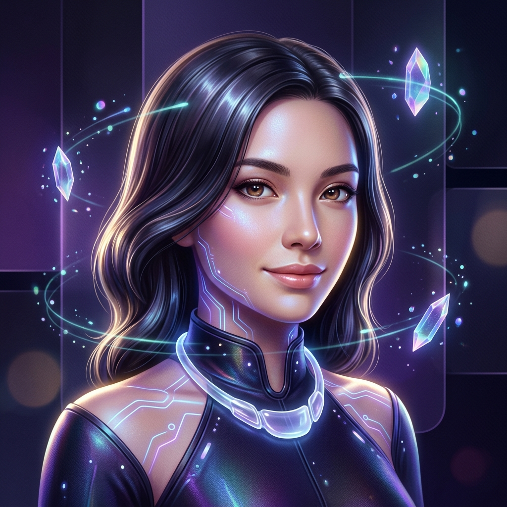
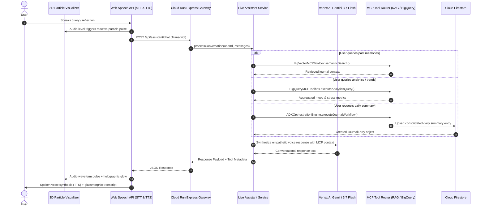

# ReflectLogixAI - Live 3D Virtual Voice Assistant (Nova)

## 1. Architectural Overview

The **Live 3D Virtual Voice Assistant ("Nova")** provides an empathetic, conversational interface to ReflectLogixAI. Inspired by **Gemini Live**, it merges real-time speech recognition, natural text-to-speech synthesis, dynamic 3D holographic particle canvas visualization, and Google Vertex AI Gemini 3.7 Flash with automated MCP tool routing.

### Mermaid Flowchart: Virtual Assistant Runtime

---

## 2. Core Capabilities & Integration

### A. 3D Holographic Particle Visualizer ([VoiceVisualizer3D.tsx](file:///d:/Siva/Books/CAREER/HACKATHON/Gen_AI_APAC_2026/ReflectLogixAI/apps/web/src/components/VoiceVisualizer3D.tsx))
- **Particle System**: 65 orbiting 3D particles with real-time perspective projection ($Z$-depth scaling).
- **Audio-Reactive Deformation**: Orbit radius, pulse velocity, and glow rings modulate dynamically in response to speech synthesis amplitude and microphone input.
- **Holographic Scanline & Aura**: Cyan, violet, and magenta lighting rings around the stylish AI avatar portrait.

### B. Live Voice & Speech Engine ([LiveVoiceAssistantModal.tsx](file:///d:/Siva/Books/CAREER/HACKATHON/Gen_AI_APAC_2026/ReflectLogixAI/apps/web/src/components/LiveVoiceAssistantModal.tsx))
- **Zero-Latency Speech Recognition**: Native `webkitSpeechRecognition` with continuous or tap-to-talk modes.
- **Natural Voice Synthesis**: Native `SpeechSynthesisUtterance` configured with warm pitch, rate modulation, and language support (English, Tamil, Hindi, French, Spanish, German, Japanese).
- **Interruption Support**: Immediate audio pause and cancellation on user speech or manual tap.

### C. Agentic RAG & MCP Invocation ([assistant.ts](file:///d:/Siva/Books/CAREER/HACKATHON/Gen_AI_APAC_2026/ReflectLogixAI/apps/api/src/server/assistant.ts))
- **Cloud SQL pgvector RAG**: Automatically queried when users ask about past reflections, specific life areas, or previous emotional states.
- **BigQuery Analytical Tool**: Summarizes 30-day stress scores, emotional valence, and top recurring topic tags.
- **ADK Subagent Mesh & Daily Summarizer**: Synthesizes the day's multiple journal fragments into an official daily summary with Socratic cognitive reframing and 3 SMART micro-actions.
